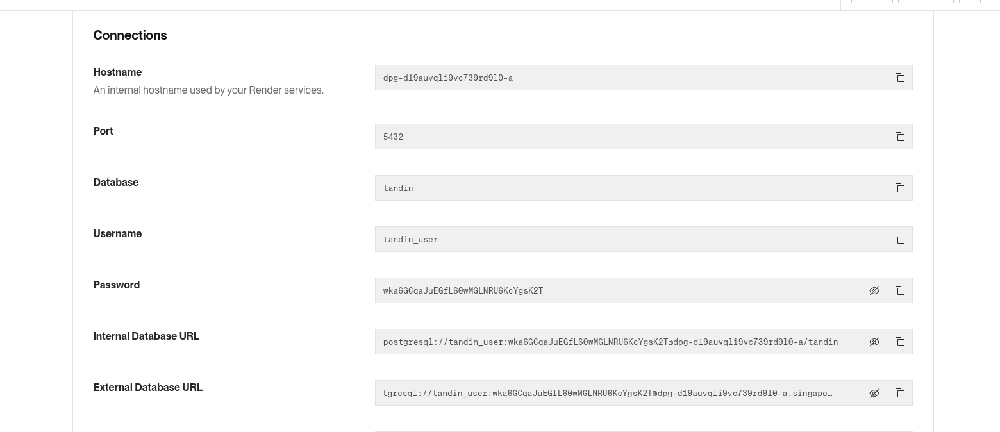
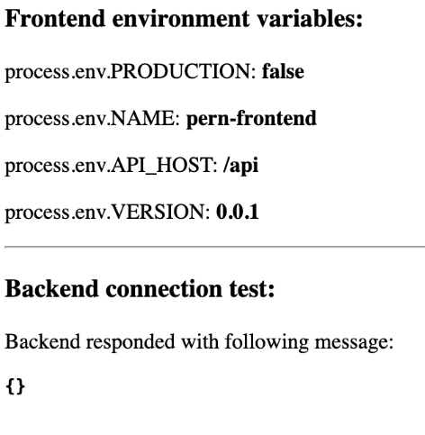
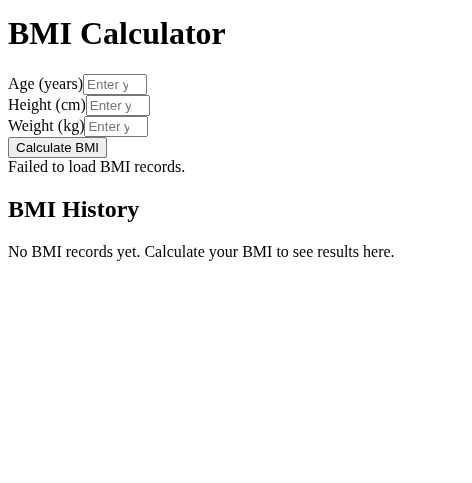

# DSO101: Continuous Integration and Continuous Deployment FINAL PROJECT

## Project Requirement

- Add a BMI calculator service to an existing PERN (PostgreSQL, Express, React, Node) stack application

- Configure Docker to handle this new service

- Set up Jenkins for automated pushes to GitHub

- Implement GitHub Actions for Docker builds

- Deploy to Render cloud platform

## Repository Setup
### Getting the Project Code

1. Fork the repository:

- Go to 

```sh
https://github.com/Darshansgit/DSO101_SE_project.git
```

- Click "Fork" in the top right to create your own copy

2. Clone your forked repository:

```sh
git clone https://github.com/YOUR-USERNAME/DSO101_SE_project.git
cd DSO101_SE_project
```
### Setting the BMI Calculator 

Backend
Created a postgres database in render.com.



Created a .env

```sh
DATABASE_HOST=dpg-d19auvqli9vc739rd9l0-a.singapore-postgres.render.com
DATABASE_PORT=5432
DATABASE_USER=tandin_user
DATABASE_PASSWORD=wka6GCqaJuEGfL60wMGLNRU6KcYgsK2T
DATABASE_NAME=tandin
```
Run the backend server:

```sh
npm start
```
Frontend

```sh
cd frontend
npm install

npm start
```


Edit App.tsx file 



Database setup

```sh
CREATE TABLE bmi_records (
    id SERIAL PRIMARY KEY,
    age INTEGER NOT NULL CHECK (age > 0 AND age <= 120),
    height DECIMAL(5, 2) NOT NULL CHECK (height > 0 AND height < 300),
    weight DECIMAL(5, 2) NOT NULL CHECK (weight > 0 AND weight < 500),
    bmi_value DECIMAL(5, 2),
    bmi_category VARCHAR(20),
    created_at TIMESTAMP WITH TIME ZONE DEFAULT CURRENT_TIMESTAMP,
    updated_at TIMESTAMP WITH TIME ZONE DEFAULT CURRENT_TIMESTAMP
```

Stage 1: Docker Configuration

```sh
```


```sh
```